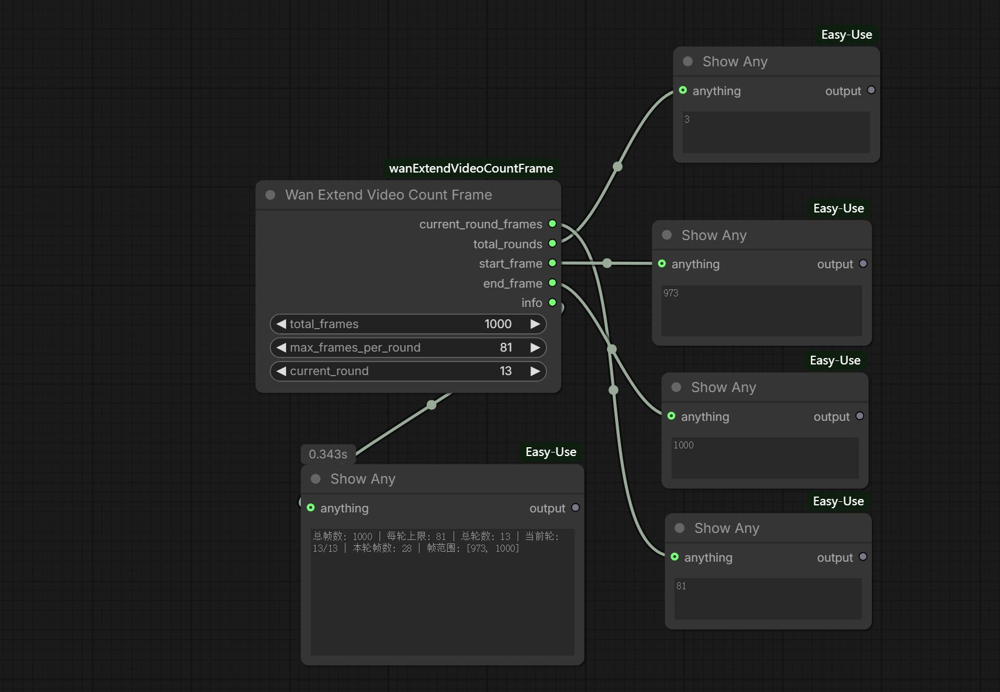

# wanExtendVideoCountFrame

A ComfyUI utility node for **WAN video model** workflows — designed to work with wanAnimate, Scail2 extend video pipelines.

When generating long videos with WAN, each workflow run has a maximum frame limit (default **81 frames**). This node automatically calculates how many rounds are needed for your total frame count, and tells you exactly how many frames to use in each round — including the final partial round.



---

## Why You Need This

WAN's Extend Video workflow works by chaining runs together. Each run takes the last frame(s) of the previous video as a starting image and generates the next segment. The problem: you can't just set 500 frames and hit run — you need to manually figure out how many segments to split it into, and what to set the frame count to on the final run so you don't overshoot your target.

This node does that math for you instantly.

---

## Installation

Copy `wanExtendVideoCountFrame.py` into your ComfyUI custom nodes directory:

```
ComfyUI/custom_nodes/wanExtendVideoCountFrame.py
```

Then **restart ComfyUI** (full restart, not just browser refresh).

The node will appear under the category: `Video / Frame Utils`

---

## Inputs

| Parameter | Type | Default | Description |
|---|---|---|---|
| `total_frames` | INT | 163 | The total number of frames you want your final video to be |
| `max_frames_per_round` | INT | 81 | Maximum frames WAN can generate per run (81 for most WAN models) |
| `current_round` | INT | 1 | Which round you are currently running (starts at 1) |

---

## Outputs

| Output | Type | Description |
|---|---|---|
| `current_round_frames` | INT | **Frames to set in WAN for this round** — wire this directly into the frame count input |
| `total_rounds` | INT | Total number of runs needed to complete your video |
| `start_frame` | INT | The first frame number this round covers (1-based) |
| `end_frame` | INT | The last frame number this round covers (1-based) |
| `info` | STRING | Summary string for debugging — connect to a Show Any node |

---

## How It Works

All rounds except the last use the full `max_frames_per_round` value. The final round uses only the remaining frames needed to reach your exact `total_frames` target.

**Example — 163 frames, max 81 per round:**

| Round | `current_round_frames` | Frame Range |
|---|---|---|
| 1 | 81 | 1 – 81 |
| 2 | 81 | 82 – 162 |
| 3 | **1** | 163 – 163 |

**Total rounds needed: 3**

**Example — 1000 frames, max 81 per round:**

| Round | `current_round_frames` | Frame Range |
|---|---|---|
| 1–12 | 81 | 1 – 972 |
| 13 | **28** | 973 – 1000 |

**Total rounds needed: 13**

---

## Typical Workflow Setup

```
[wanExtendVideoCountFrame]
    total_frames         → your target length
    max_frames_per_round → 81 (or match your WAN model limit)
    current_round        → 1  (change this each run)
         │
         ▼
  current_round_frames ──► WAN Frame Count input
  total_rounds         ──► Show Any  (so you know how many runs to do)
  info                 ──► Show Any  (full summary per run)
```

**Each run:**
1. Check `total_rounds` — this is how many times you need to run the workflow
2. Set `current_round` to the round you're on (1, 2, 3 ...)
3. `current_round_frames` feeds directly into WAN's frame count — no manual math needed
4. After each run, take the last frame as your new start image for the next round
5. On the final round, the node automatically outputs the exact remaining frames

---

## Notes

- If `current_round` is set higher than `total_rounds`, the node clamps it to the last round and adds a warning to the `info` output — it won't crash your workflow
- `max_frames_per_round` can be changed freely if a future WAN model version supports a different limit
- Frame range outputs (`start_frame`, `end_frame`) are 1-based to match natural frame counting

---
---

# wanExtendVideoCountFrame（中文说明）

专为 **WAN 视频模型**工作流设计的 ComfyUI 工具节点 — 适用于 wanAnimate、Scail2 extend video 等延伸视频流程。

WAN 每次工作流运行有最大帧数限制（默认 **81 帧**）。此节点自动计算你的目标总帧数需要跑几轮，并告诉你每轮应该填写多少帧数 — 包括最后一轮的剩余帧数。


---

## 为什么需要这个节点

WAN 的 Extend Video 工作流通过多次串联运行来生成长视频：每次运行以上一段视频的最后一帧作为起始图，继续生成下一段。问题在于：你不能直接填 500 帧然后运行 — 你需要手动计算要分几段跑，以及最后一段应该填多少帧才能刚好达到目标时长，不多也不少。

这个节点帮你瞬间算好一切。

---

## 安装方法

将 `wanExtendVideoCountFrame.py` 复制到 ComfyUI 的自定义节点目录：

```
ComfyUI/custom_nodes/wanExtendVideoCountFrame.py
```

然后**完全重启 ComfyUI**（不是刷新浏览器，是关闭进程后重新启动）。

节点会出现在分类：`Video / Frame Utils`

---

## 输入参数

| 参数 | 类型 | 默认值 | 说明 |
|---|---|---|---|
| `total_frames` | INT | 163 | 目标视频总帧数 |
| `max_frames_per_round` | INT | 81 | 每轮工作流最大帧数（大多数 WAN 模型为 81） |
| `current_round` | INT | 1 | 当前是第几轮（从 1 开始） |

---

## 输出参数

| 输出 | 类型 | 说明 |
|---|---|---|
| `current_round_frames` | INT | **当前轮应填写的帧数** — 直接连接到 WAN 的帧数输入 |
| `total_rounds` | INT | 完成整个视频需要跑的总轮数 |
| `start_frame` | INT | 本轮起始帧编号（从 1 开始计数） |
| `end_frame` | INT | 本轮结束帧编号（从 1 开始计数，含） |
| `info` | STRING | 调试信息汇总字符串 — 连接到 Show Any 节点查看 |

---

## 计算逻辑

除最后一轮外，所有轮次都使用完整的 `max_frames_per_round` 帧数。最后一轮只输出恰好达到 `total_frames` 所需的剩余帧数。

**示例 — 总帧数 163，每轮上限 81：**

| 轮次 | `current_round_frames` | 帧范围 |
|---|---|---|
| 第 1 轮 | 81 | 1 – 81 |
| 第 2 轮 | 81 | 82 – 162 |
| 第 3 轮 | **1** | 163 – 163 |

**共需 3 轮**

**示例 — 总帧数 1000，每轮上限 81：**

| 轮次 | `current_round_frames` | 帧范围 |
|---|---|---|
| 第 1–12 轮 | 81 | 1 – 972 |
| 第 13 轮 | **28** | 973 – 1000 |

**共需 13 轮**

---

## 典型接线方式

```
[wanExtendVideoCountFrame]
    total_frames         → 你的目标总帧数
    max_frames_per_round → 81（或根据 WAN 模型上限修改）
    current_round        → 1（每轮运行时手动改成对应轮次）
         │
         ▼
  current_round_frames ──► WAN 帧数输入
  total_rounds         ──► Show Any（查看总共需要跑几轮）
  info                 ──► Show Any（查看本轮完整摘要信息）
```

**每轮操作流程：**
1. 先看 `total_rounds` 输出 — 这是你需要运行工作流的总次数
2. 将 `current_round` 设置为当前轮次（1、2、3……）
3. `current_round_frames` 直接接入 WAN 的帧数参数 — 不需要手动计算
4. 每轮运行完成后，取最后一帧作为下一轮的起始图
5. 最后一轮时，节点自动输出精确的剩余帧数

---

## 注意事项

- 如果 `current_round` 输入值超过 `total_rounds`，节点会自动限制到最后一轮并在 `info` 输出中附加警告，不会导致工作流报错
- `max_frames_per_round` 可以自由修改，方便适配未来支持不同帧数上限的 WAN 模型版本
- `start_frame` 和 `end_frame` 采用从 1 开始的计数方式，符合日常帧编号习惯
